# ProShop

An E-commerce website build with React, Redux, NodeJS, JavaScript, MongoDB, and React-Bootstrap.

## Project Status

This project is completed enough to showcase my skills. The website include Products List, Product Details, Shopping Cart, Checkout Process, Admin Pages, Profile, Order, Sign-in, and Sign-out screens. Functionalites like User Authentication & Authorization, Interaction with the Shopping Cart, PayPal payment API, Product Reviews, Rating and Search, Product Pagination, Image Uploading and Tops Products Carousel.

The project is live at: https://phih-proshop.herokuapp.com/

## Reflection

This was a 3 week long project built as a side project to learn and improve my MERN stack development skill.

The project was mean to be a simple e-commerce website that can display the products, add and remove items to shopping cart, checkout process, view user profile and orders, review, rate and search the product.

The notable technologies implemented in this project are Redux for State Management, JWT for User Authentication, PayPal API. Additional features like Pagination, Tops Products Carousel, and Image Uploading.

## Installation

1. Clone this repo. You will need node and npm installed on your machine
2. Open the project in your IDE and run the following command on your command line:
```
npm install
```

## Screen Shots

Home / Product List Screen

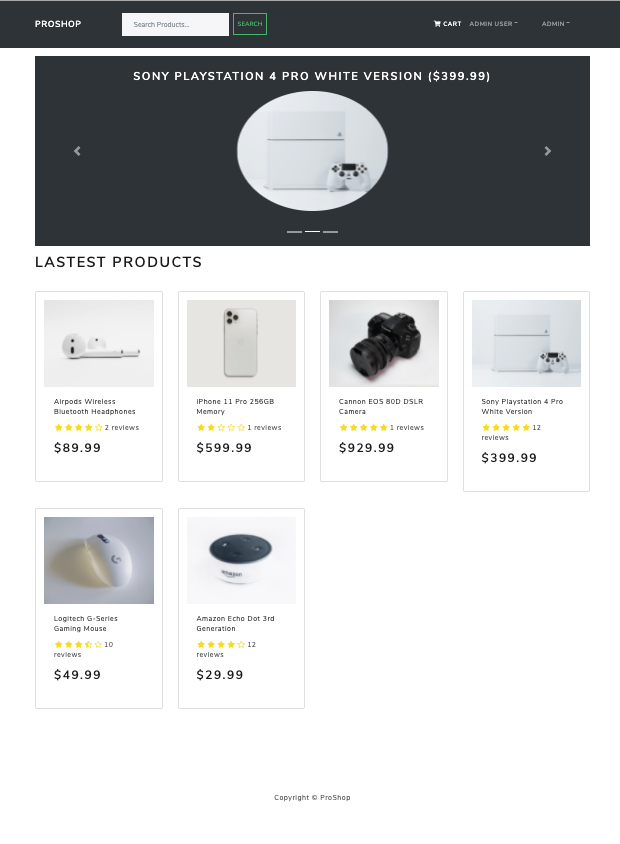

Product Details Screen

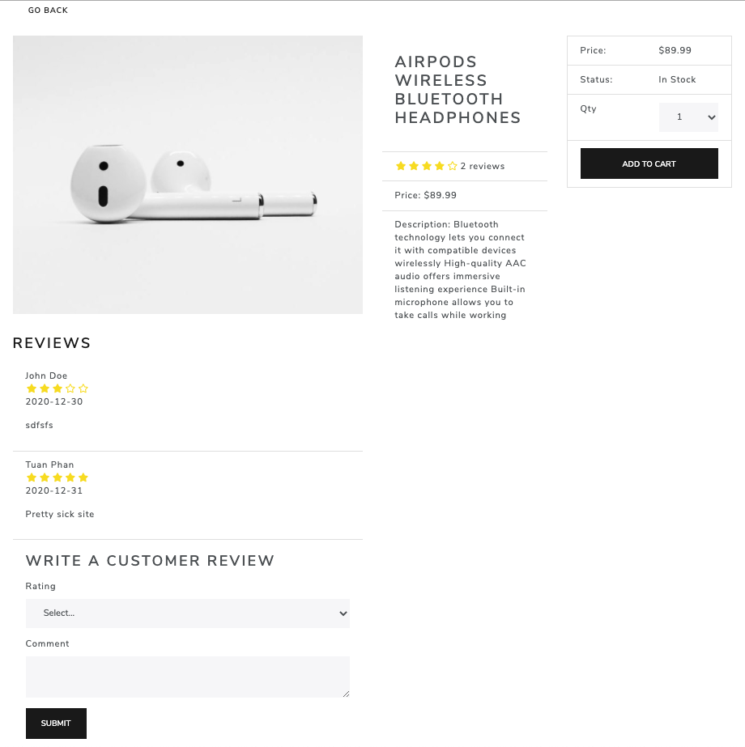

Shopping Cart Screen

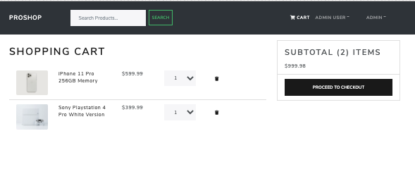

Shipping Address Screen

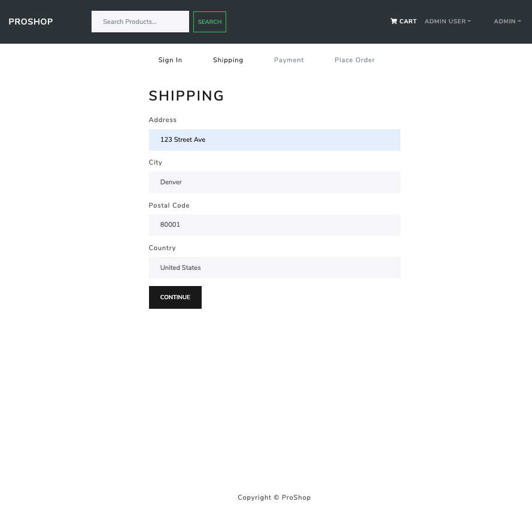

Payment Method Screen


Place Order Screen

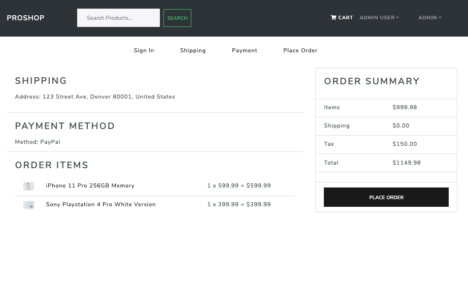

Payment Screen

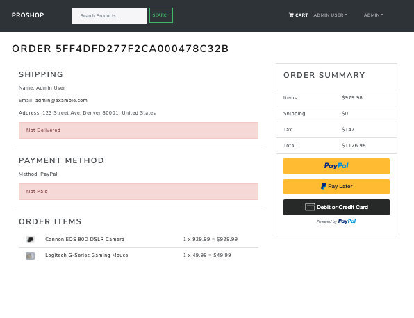

Order Screen

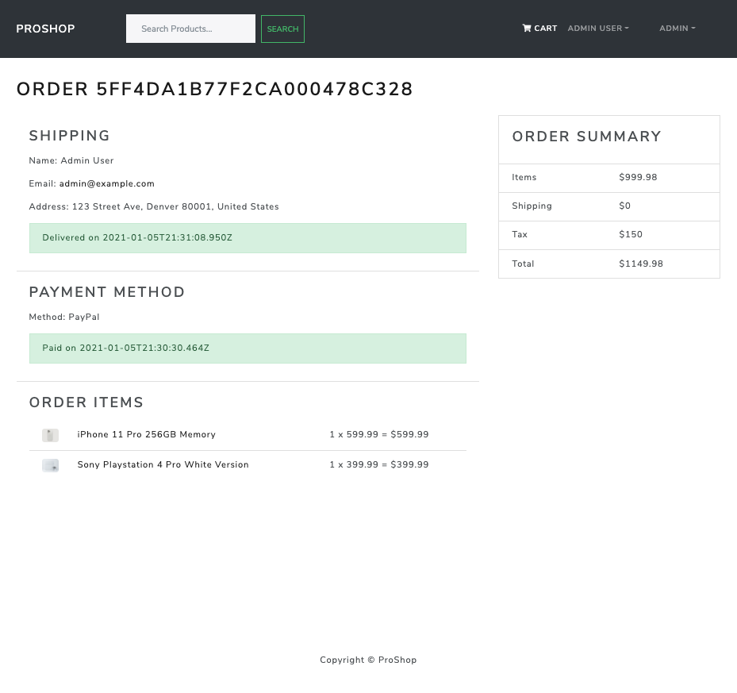

Admin User List Screen

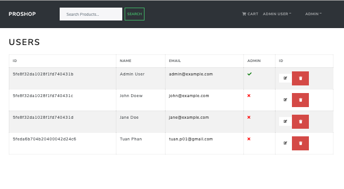

Admin Product List Screen

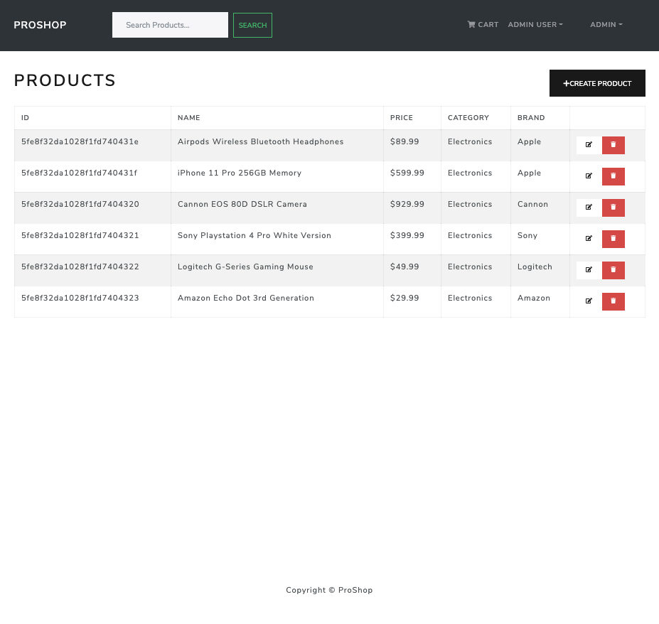

Admin Order List Screen

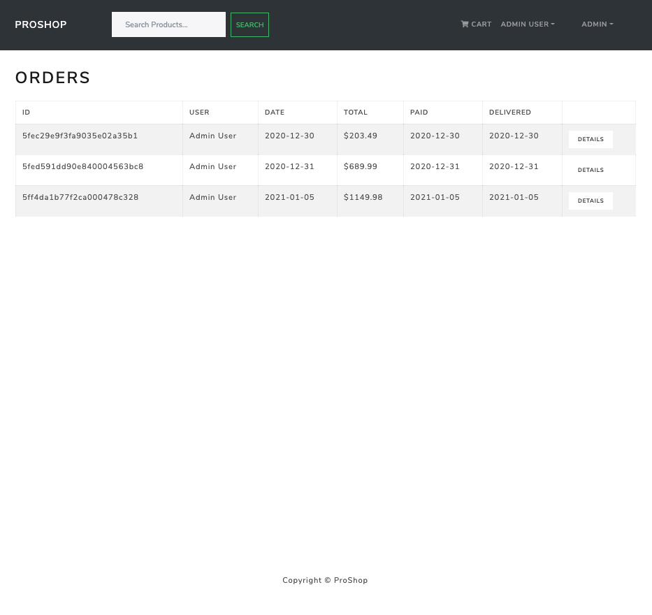

Search

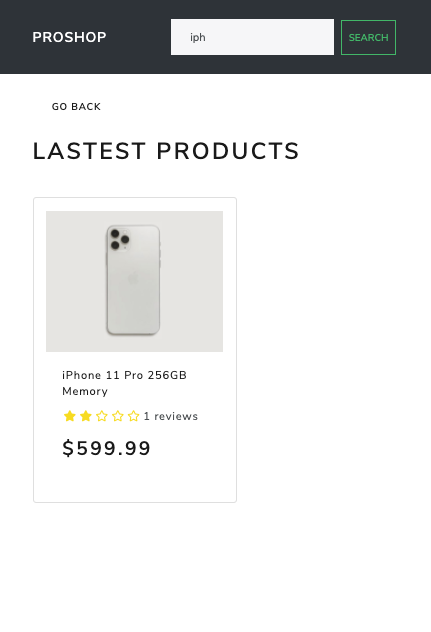

Sign-in Screen

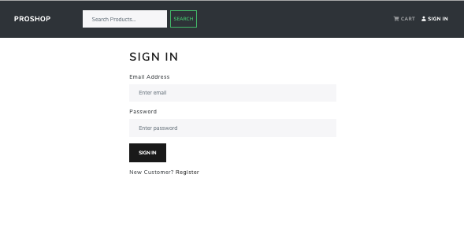

Sign-up Screen

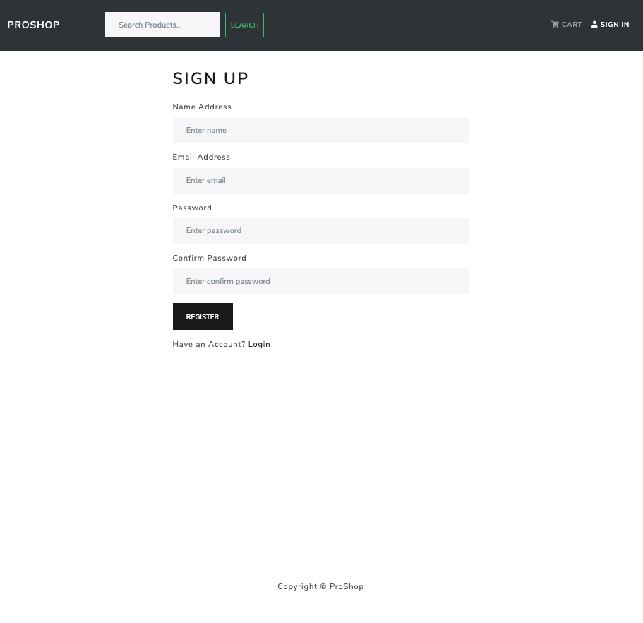

User Profile

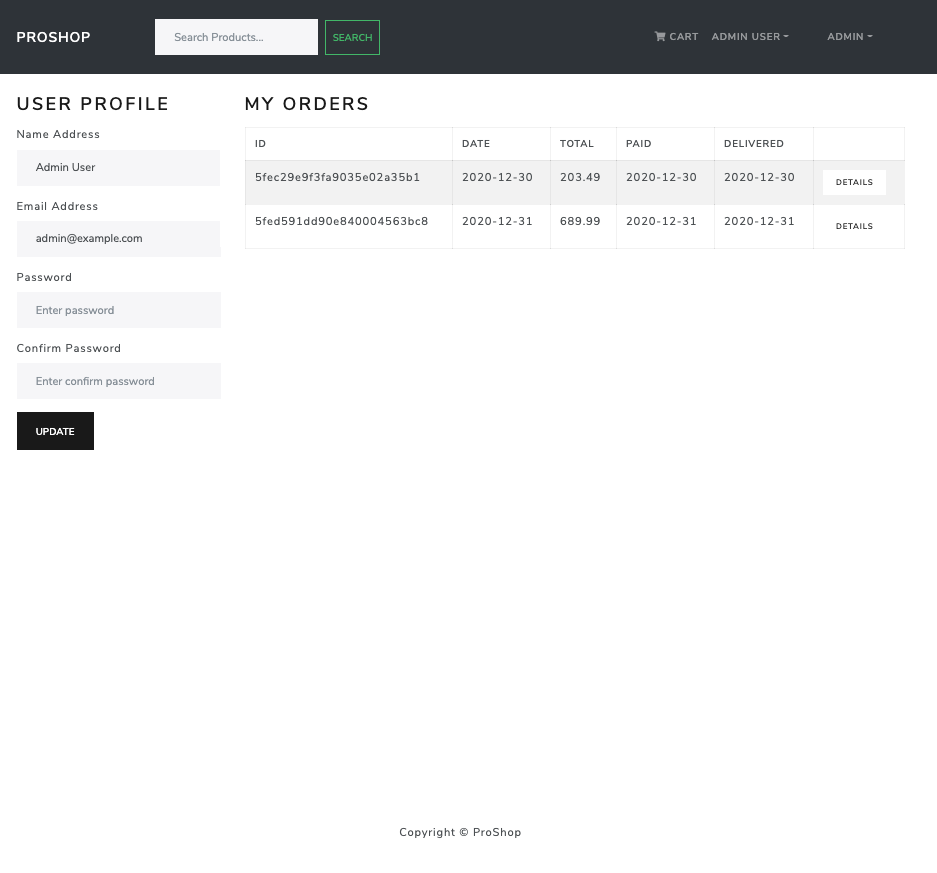
