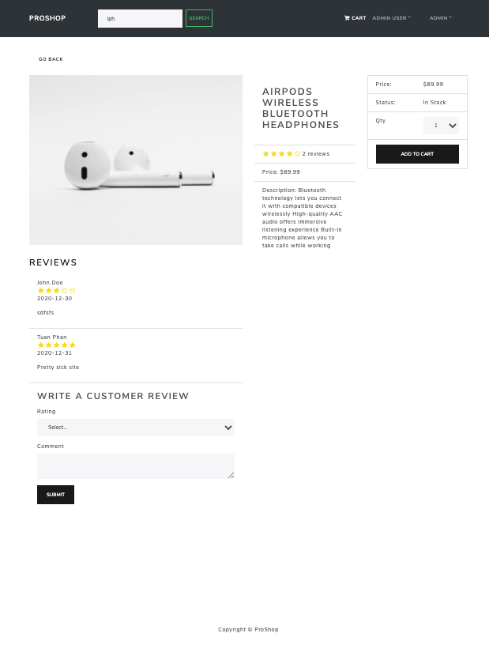
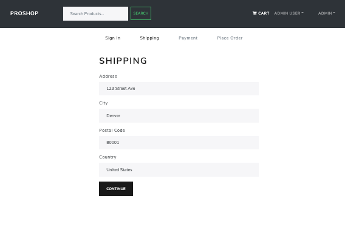
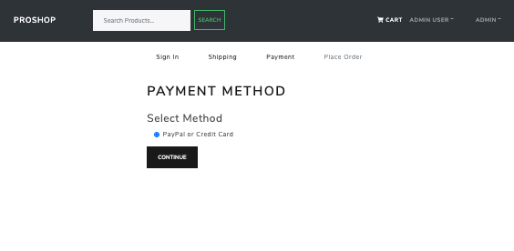
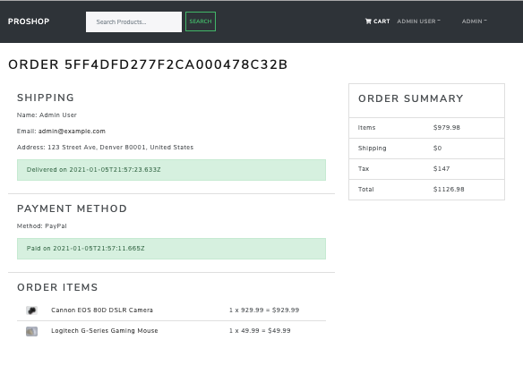
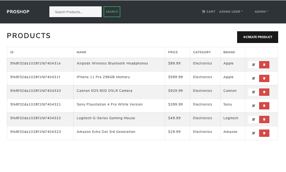
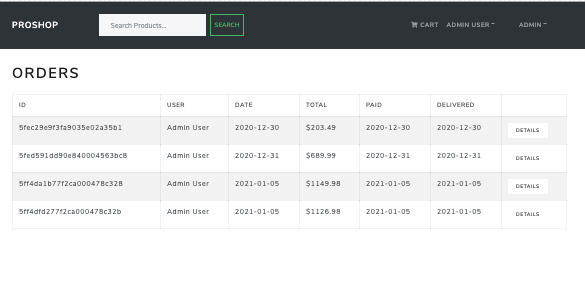
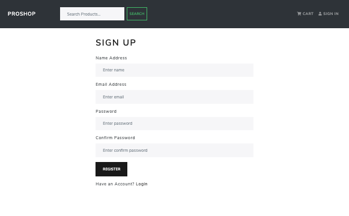
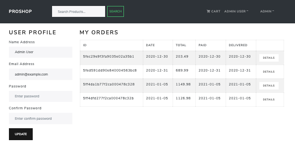

# ProShop

An E-commerce website build with React, Redux, NodeJS, JavaScript, MongoDB, and React-Bootstrap.

# Project Status

This project is completed enough to showcase my skills. The website include Products List, Product Details, Shopping Cart, Checkout Process, Admin Pages, Profile, Order, Sign-in, and Sign-out screens. Functionalites like User Authentication & Authorization, Interaction with the Shopping Cart, PayPal payment API, Product Reviews, Rating and Search, Product Pagination and Tops Products Carousel.

The project is live at: https://phih-proshop.herokuapp.com/

# Screen Shots

Home / Product List Screen

Product Details Screen

Shopping Cart Screen

Shipping Address Screen

Payment Method Screen

Place Order Screen

Payment Screen

Order Screen

Admin User List Screen

Admin Product List Screen

Admin Order List Screen

Search

Sign-in Screen

Sign-up Screen

User Profile

